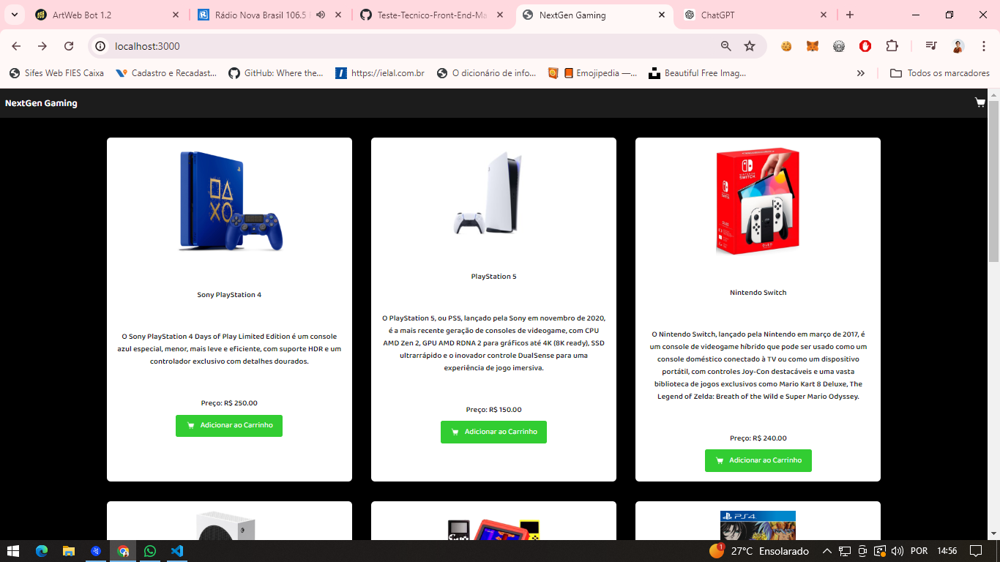
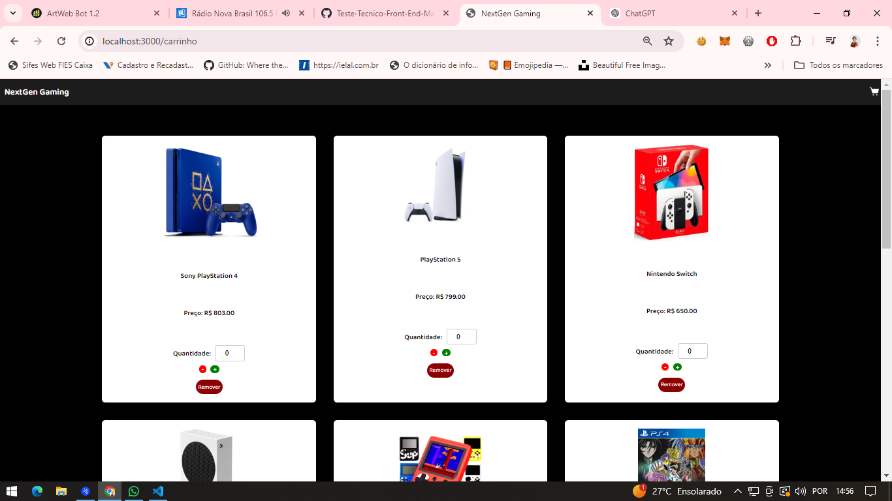

# NextGen Gaming 🎮

## Descrição do Projeto

NextGen Gaming é um projeto desenvolvido como parte de um desafio técnico para a posição de Desenvolvedor Frontend Pleno na NextGen Development. O propósito do desafio é criar uma aplicação web de comércio eletrônico especializada em jogos e consoles, proporcionando uma experiência de usuário fluida e atrativa. 

## Propósito do Desafio Técnico

O objetivo principal deste desafio é avaliar a capacidade de criar uma aplicação web completa e funcional utilizando tecnologias modernas de desenvolvimento web. A aplicação deve ser capaz de listar produtos, adicionar itens ao carrinho de compras, e ter uma interface de usuário responsiva e intuitiva.

## Tecnologias Utilizadas

- **HTML5**: Utilizado para estruturar o conteúdo da aplicação.
- **CSS3**: Utilizado para estilizar a aplicação e garantir uma interface de usuário atrativa e responsiva.
- **JavaScript**: Utilizado para adicionar interatividade à aplicação.
- **React JS**: Utilizado para desenvolver a interface de usuário de forma modular, eficiente e reativa.

## Justificativa para a Escolha do React JS

React JS foi escolhido como a biblioteca principal para o desenvolvimento da interface de usuário deste projeto por várias razões:

1. **Componentização**: React permite dividir a aplicação em componentes reutilizáveis, facilitando a manutenção e escalabilidade do código.
2. **Virtual DOM**: React utiliza um Virtual DOM para otimizar as atualizações da interface de usuário, resultando em uma performance mais eficiente.
3. **Comunidade e Ecossistema**: React possui uma vasta comunidade de desenvolvedores e uma ampla gama de bibliotecas e ferramentas que complementam o desenvolvimento, como React Router para gerenciamento de rotas e Redux para gerenciamento de estado.
4. **Desenvolvimento Declarativo**: Com React, a criação de interfaces de usuário é mais intuitiva e previsível, utilizando uma abordagem declarativa onde se descreve o resultado desejado, e o React cuida das atualizações necessárias.
5. **Suporte a JSX**: JSX, uma extensão de sintaxe para JavaScript, permite escrever código que se assemelha a HTML, tornando o desenvolvimento de componentes mais intuitivo e legível.

## Funcionalidades Principais

- **Listagem de Produtos**: Exibe uma lista de produtos (jogos e consoles) com suas respectivas imagens, descrições e preços.
- **Carrinho de Compras**: Permite adicionar produtos ao carrinho de compras.
- **Responsividade**: Interface de usuário adaptável a diferentes tamanhos de tela, garantindo uma experiência consistente em dispositivos móveis e desktops.

# Prints das Telas Desenvolvidas

## Tela Inicial do Site

<br><br>

# Tela do Carrinho de Compras


## Como Executar o Projeto

### Pré-requisitos

- Node.js (versão LTS recomendada)
- npm ou yarn

### Passos para Executar

1. **Clone o repositório**:
    ```bash
    git clone https://github.com/usuario/Teste-Tecnico-Front-End-Maria-De-Fatima-Nunes-Alves.git
    ```
2. **Instale as dependências**:
    ```bash
    cd Teste-Tecnico-Front-End-Maria-De-Fatima-Nunes-Alves/
    npm install
    ```
3. **Execute a aplicação**:
    ```bash
    npm start
    ```
4. **Acesse a aplicação**:
    Abra o navegador e vá para `http://localhost:3000`

## Considerações Finais

Este projeto demonstra a capacidade de criar uma aplicação web funcional e moderna utilizando as melhores práticas de desenvolvimento frontend. React JS foi escolhido por sua eficiência, modularidade e ampla adoção na indústria, o que garante que a aplicação seja robusta e escalável.
